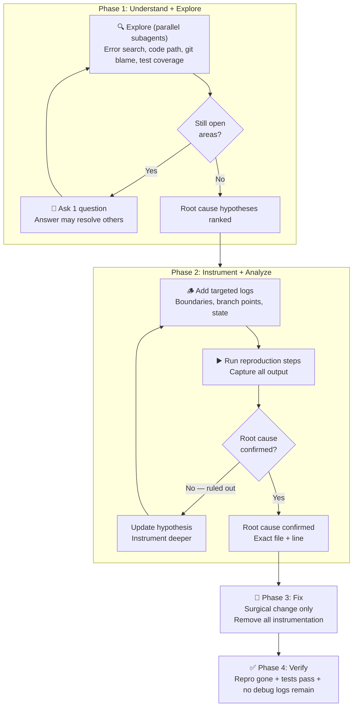

# 🔎 fix.md

A systematic bug-fixing workflow for Claude Code. Not a vibe-based "just fix it" — a disciplined instrument-observe-narrow loop that forces the model to confirm root cause before touching production code.

Explore first, instrument strategically, read the logs, fix surgically, verify clean.

[](https://github.com/amajorai/fix.md)
[](https://github.com/amajorai/fix.md)
[](https://github.com/amajorai/fix.md)
[](https://github.com/amajorai/fix.md)
[](https://github.com/amajorai/fix.md/issues)

> [!NOTE]
> These skills have been built and tested with **Claude Code**. Codex support is untested. If you try them on Codex, we'd love your help. [Open an issue](https://github.com/amajorai/fix.md/issues) to share what works and what doesn't.

## Quickstart

```bash
npx skills add -g amajorai/fix.md
```

Then in Claude Code:

```
/fix the login form submits but the user session is never created
```

or with a stack trace pasted in:

```
/fix TypeError: Cannot read properties of undefined (reading 'userId') at middleware.ts:42
```

### Claude Code plugin

```
/plugin marketplace add amajorai/fix.md
/plugin install fixmd@amajorai
```

Invoke as `/fixmd:fix <bug description>`.

## Works great with

- 👻 **[spec.md](https://github.com/amajorai/spec.md)** to turn a vague "something is broken" report into an atomic, scoped fix issue with clear acceptance criteria before handing it to `/fix`.
- 📦 **[ship.md](https://github.com/amajorai/ship.md)** to build and ship new features once the bugs are squashed.
- 🪅 **[vibe.md](https://github.com/amajorai/vibe.md)** to spin up your production server and deploy pipeline.
- 🎉 **[party.md](https://github.com/amajorai/party.md)** to run autonomously 24/7 — drop issues into a board and let it hunt bugs automatically.
- 🎬 **[replay.md](https://github.com/amajorai/replay.md)** to record video proof of the bug before and after the fix.

## Skills

| Skill | What it does |
|-------|-------------|
| [`/fix`](skills/fix/SKILL.md) | Full 4-phase pipeline: understand+explore loop (one question at a time, search first), instrument+analyze loop (targeted logs, auto-read output, iterate until root cause confirmed), surgical fix, verify clean |

## How it works



## Why instrument instead of guess

Most LLM bug fixes are educated guesses. They look plausible, pass review, and sometimes even pass tests — then the same bug comes back in a slightly different form because the root cause was never confirmed.

`/fix` forces confirmation before the fix:

1. **Explore** the codebase to form hypotheses (parallel subagents, no guessing from memory)
2. **Instrument** at the boundary of the suspected failure — inputs in, outputs out, state at branch points
3. **Read the logs** — if the hypothesis is wrong, instrument deeper; if right, stop and fix
4. **Fix only what the logs proved** — surgical, minimal, justified

The instrumentation is labeled `[FIX]` and fully removed before the fix is committed. No debug logs leak to production.

## Star History

<a href="https://www.star-history.com/#amajorai/fix.md&Date">
 <picture>
   <source media="(prefers-color-scheme: dark)" srcset="https://api.star-history.com/svg?repos=amajorai/fix.md&type=Date&theme=dark" />
   <source media="(prefers-color-scheme: light)" srcset="https://api.star-history.com/svg?repos=amajorai/fix.md&type=Date" />
   
 </picture>
</a>
